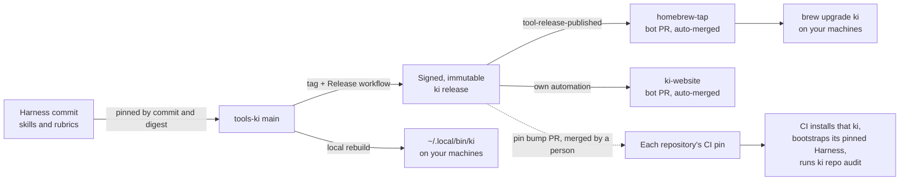

# How releases reach your repositories

After reading this guide you will know how a change to `ki` or to the Harness gets from a commit into every repository's CI and onto your own machine, who or what moves each step today, and what you, as owner, need to do and when. It explains the flow; the [releasing guide](../developer/releasing.md) owns the release procedure and the [release-on-demand policy](https://github.com/knowledgeislands/ki-agentic-harness/blob/main/skills/repo-structure/ki-repo-tools/references/standards-release-readiness.md#release-on-demand) owns release timing.

## The picture

Solid arrows are automated today. The dotted arrow is manual.

## 1. What a release contains

A `tools-ki` release is three compiled archives (`darwin-arm64`, `darwin-x64` and `linux-x64`). Each archive holds only the `ki` executable and its manual page. A checksum manifest, signed with the release key, comes with them. Once published, a release is immutable.

The executable carries one more thing: the **Harness pin**. That is the exact `ki-agentic-harness` commit, plus the digest of its archive, that `ki bootstrap` installs. `v0.10.0`, for example, pins Harness commit `7695f997`. The pin lives in the source, so it changes only through a `tools-ki` commit.

That is why a Harness change, such as a new skill or a stricter rubric criterion, does not reach anyone's CI when it merges. CI runs `ki bootstrap`, and `ki bootstrap` installs the Harness commit that the installed `ki` pins. A Harness change reaches CI only after three things happen: `tools-ki` moves its Harness pin, a release ships that pin, and the repository's CI pin moves to that release.

## 2. The release steps

The [releasing guide](../developer/releasing.md) has the exact steps. In outline:

1. **Prepare.** If the Harness has moved, bump the Harness pin first. Then set the version and changelog on `main` and run the full checks.
2. **Tag.** Push the exact `vX.Y.Z` tag on the intended `main` commit.
3. **Signed archives.** Dispatch the **Release** workflow from `main`. It builds the three archives, signs the manifest, creates a draft release, downloads and checks the published files again, and then publishes the release as immutable.
4. **Clean-install proof.** On a fresh Linux runner, the workflow installs the published release from nothing and runs `ki bootstrap`. This proves that a real user can install it.
5. **Release-event dispatch and Homebrew.** The workflow sends a `tool-release-published` event to `homebrew-tap`. The tap's bot opens a formula pull request and squash-merges it. A daily scheduled run catches any release that a missed event left behind. The website follows the same pattern under its own decision.

The release dispatches only to the tap, so it does not notify the other repositories.

## 3. How each repository's CI picks its `ki`

Every repository's CI installs one exact released `ki` version, verifies its signature, bootstraps, and runs `ki repo audit`. That version is the repository's **pin**, and it is held in one of two places:

- **`.github/ki-version` receiver file.** Only the Harness uses this today. The file holds one line, such as `v0.8.4`. A receiver workflow, `update-ki-pin.yml`, can propose a newer version in a pull request.
- **An inline `KI_VERSION` in `ci.yml`.** About 22 repositories use this, including `tools-ki`, the `mcp-*` servers, the websites and the other tools. Most pin `v0.8.4`. `hnr-agentic-harness` and `infoschematics` pin `v0.7.1`. There is no receiver, so the audit shows CI-1 as a warning.

A **pin bump** is a one-line change of that version, merged like any other change. Until a repository makes it, that repository's CI keeps using its old `ki` and the old Harness that it pins, whatever has been released since.

## 4. Who opens pin-bump pull requests

- **Today, a person does.** The Harness receiver needs the `ki-tools-release-bot` GitHub App, which is not installed on the Harness, so the receiver stays inert. The one Harness bump so far, PR #25 (`v0.8.4` to `v0.10.0`), was opened by hand. Inline pins are always edited by hand.
- **With the bot installed on the Harness**, a release would open the bump pull request automatically, either from the next daily run or from a dispatch. A person would still merge it.
- **Auto-merge** is the question in [KI-HARNESS-GOV-161](https://github.com/knowledgeislands/ki-agentic-harness/blob/main/docs/roadmap/KI-HARNESS-GOV-161-auto-merge-ki-pins.md). It asks whether that bot pull request may merge itself once CI passes, as the tap and website already do. The options are: stay manual (A), install the bot but keep a human merge (B), auto-merge on the Harness only (C), or auto-merge across the whole estate (D). The brief recommends C. C first needs a `main` ruleset that requires CI and an amendment to XDR-KI-HARNESS-001. Inline-pin repositories stay manual under every option except D.

## 5. How the `ki` on your machines is updated

You may have two copies of `ki` on your `PATH`. The first one found is the one that runs.

- **Local rebuild**, at `~/.local/bin/ki`. To use something delivered but not yet released, rebuild from `main` with the single command in [rebuild the local ki from main](../developer/local-development.md#rebuild-the-local-ki-from-main). The rebuilt copy still reports the last released version number, so run `git log -1` in the checkout to see which commit you are running.
- **Homebrew**, at `/opt/homebrew/bin/ki`. The tap follows every release automatically, but your installed copy moves only when you run `brew upgrade ki`. `ki update` never replaces an executable that Homebrew owns.

`ki update` refreshes your installed Harnesses. See [maintain a local installation](local-installation.md).

## 6. When to release, and when to move a pin

Releases are held by default. Release when one of these is true:

- Something else needs the new capability, such as another repository's CI or another person's machine.
- There is something significant to ship.
- Significant changes have built up since the last release.

Batch accumulated changes into one release rather than releasing after every change. Delivered work closes without waiting for a release.

Move a repository's pin only when that repository needs the new version, for example to enforce a new rubric criterion in its CI. An older pin is not a failure. A bump proposal that a repository does not need yet can stay open or be closed.

## 7. What you need to do, and when

- **When you want new capability yourself:** rebuild locally from `main`. Do not release just for this.
- **When a release is due:** ask for one, naming it as an explicit, authorised task. Agents never release as part of delivering work. Check that the Harness pin is current first.
- **After a release:** run `brew upgrade ki` on each machine that uses the Homebrew copy. The tap updates by itself.
- **When a repository needs the new rules in CI:** merge or make its pin bump. For the Harness that is PR #25 or a successor. For inline pins, edit `KI_VERSION`.
- **Once:** decide [KI-HARNESS-GOV-161](https://github.com/knowledgeislands/ki-agentic-harness/blob/main/docs/roadmap/KI-HARNESS-GOV-161-auto-merge-ki-pins.md) (option A, B, C or D). Revisit it when a second maintainer joins.
